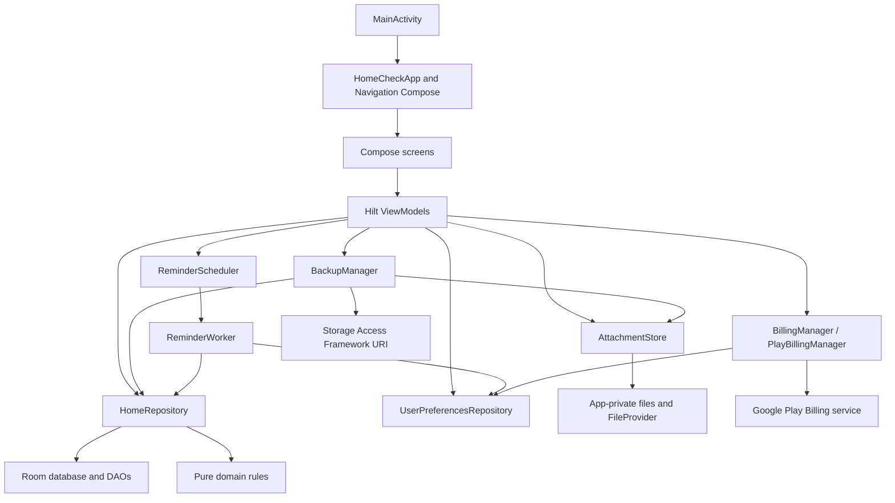

<!-- generated-by: gsd-doc-writer -->

# homecheck Project Reference

## 1. Purpose and scope

`homecheck` is a private, offline-first Android application for maintaining a local record of appliances, home systems, tools, and other equipment. A record can contain identifying details, a photo, purchase and warranty dates, imported documents, scheduled maintenance, and maintenance history.

The application is deliberately narrow in its service model:

- There is no homecheck account system, application backend, synchronization service, advertising SDK, or analytics SDK in this repository.
- Structured home data is stored in a local Room database.
- Imported photos and documents are copied into app-private internal storage.
- Preferences and the last successfully verified premium entitlement are stored in Preferences DataStore.
- User-initiated backup and restore use a versioned ZIP archive selected through Android's Storage Access Framework.
- The only paid feature is a one-time Google Play in-app product that removes the free three-asset limit.
- Reminders are generated locally by WorkManager and delivered through Android notifications.

This document describes the current working-tree implementation as of 2026-08-07. Source code remains the final authority. Refresh this file whenever routes, persisted data, business rules, product limits, billing behavior, backup format, or the UI system changes.

## 2. Current project identity

| Property | Current value |
|---|---|
| Repository shape | Single Gradle project with one Android application module, `:app` |
| Root project name | `homecheck` |
| Android namespace | `com.finnvek.homecheck` |
| Application ID | `com.finnvek.homecheck` |
| Version | `versionName = 1.0.0`, `versionCode = 1` |
| Minimum Android API | 26 |
| Compile and target API | 37 |
| Java bytecode/source compatibility | Java 17 |
| Gradle wrapper | 9.7.0 |
| Android Gradle Plugin | 9.3.1 |
| Kotlin | 2.2.10 |
| UI toolkit | Jetpack Compose with Material 3 |
| Persistence | Room schema version 1, Preferences DataStore, app-private files |
| Dependency injection | Hilt |
| Background execution | WorkManager |
| Billing | Google Play Billing, one-time INAPP product |
| Source language | Kotlin; UI strings currently have one English resource set |

At the time of this snapshot, the production source contains 53 Kotlin files and approximately 4,832 Kotlin lines under `app/src/main/java`. The test tree contains 10 local unit-test files with 25 test methods and 9 instrumented-test files with 15 test methods.

## 3. Product behavior at a glance

The main user journey is:

1. The first launch presents a single onboarding screen.
2. Completing onboarding opens the Home destination.
3. The user adds an asset. Only the asset name is required.
4. The user may add a photo, product identifiers, location, purchase data, a warranty date, and notes.
5. From an asset detail screen, the user may import documents and create maintenance tasks.
6. Maintenance can be one-time or recurring. Completion creates a history snapshot; a recurring task receives its next due date based on the actual completion date.
7. Local reminders can notify on due or periodically overdue maintenance and at three warranty milestones.
8. A free user can create up to three assets. Attempting a fourth opens the premium purchase sheet.
9. Settings provide appearance, reminder, manual backup/restore, purchase, version, and privacy controls.

Existing records remain viewable regardless of billing availability. The premium gate is checked only when a new asset is requested.

## 4. Architecture

### 4.1 Architectural style

The application is a single-process, single-activity Compose application using a pragmatic layered structure:

- Compose screens render immutable UI state and invoke callbacks.
- Hilt ViewModels combine reactive repository, preference, and billing flows into screen state.
- `HomeRepository` is the primary structured-data facade over Room DAOs and owns the maintenance completion transaction.
- `AttachmentStore` owns app-private attachment files and `FileProvider` URI creation.
- Small domain objects implement deterministic product rules without Android dependencies.
- `BackupManager`, `PlayBillingManager`, and the notification classes integrate with Android platform services.

There is no separate use-case layer. Most ViewModels call `HomeRepository`, `UserPreferencesRepository`, `BillingManager`, `BackupManager`, `AttachmentStore`, or `ReminderScheduler` directly.

### 4.2 Component diagram



### 4.3 Source layout

```text
app/src/main/java/com/finnvek/homecheck/
├── HomeCheckApplication.kt       Process initialization and WorkManager configuration
├── MainActivity.kt               Splash screen, edge-to-edge host, notification intent handling
├── backup/                       Backup model, JSON codec, ZIP validation, export and restore
├── billing/                      Billing abstraction, entitlement rule, Play Billing implementation
├── data/
│   ├── files/                    Internal attachment storage and FileProvider URIs
│   ├── local/                    Room database, converters, entities, and DAOs
│   ├── preferences/              Preferences DataStore model and access
│   └── repository/               Structured-data facade and Room transactions
├── di/                           Hilt database and billing bindings
├── domain/                       Pure asset, maintenance, warranty, and notification rules
├── notifications/                WorkManager scheduling and notification production
└── ui/
    ├── HomeCheckApp.kt           App shell, routes, platform launchers, dialogs, and navigation wiring
    ├── MainViewModel.kt          App-wide preferences, billing, premium gate, and one-shot events
    ├── HomeCheckPreviews.kt      Representative Compose previews
    ├── assetdetail/              Asset detail state, UI, document actions, and deletion
    ├── assets/                   Asset list/search/sort and asset create/edit form
    ├── components/               Image loading, date/due formatting, status illustration
    ├── home/                     Dashboard state and UI
    ├── maintenance/              Maintenance list/history and create/edit form
    ├── onboarding/               First-launch screen
    ├── premium/                  Purchase bottom-sheet content
    ├── settings/                 Settings state and UI
    └── theme/                    Static/dynamic color schemes, typography, shapes, and spacing
```

### 4.4 Startup and process lifecycle

`HomeCheckApplication` is annotated with `@HiltAndroidApp` and implements `Configuration.Provider` so WorkManager can use the injected `HiltWorkerFactory`. The manifest removes WorkManager's default `WorkManagerInitializer`; initialization therefore relies on the application-provided configuration.

At process start, `HomeCheckApplication.onCreate()`:

1. Creates the notification channel.
2. Starts a process-lifetime coroutine scope using `SupervisorJob + Dispatchers.Default`.
3. Reads the first `UserPreferences` value.
4. Schedules or cancels the unique periodic reminder work according to the saved global reminder preference and time.

`MainActivity`:

- installs the AndroidX splash screen before `super.onCreate()`;
- enables edge-to-edge drawing;
- hosts the entire UI with `setContent`;
- stores a notification navigation target in Compose mutable state; and
- uses `singleTop` launch mode plus `onNewIntent()` so tapping a later notification can redirect an existing activity instance.

The app shell waits for the first preference value. While preferences are still `null`, it renders an empty `Surface`. It then renders either onboarding or the navigation graph. The premium sheet is app-global and may be shown above either state.

### 4.5 Dependency injection

Hilt provides application-singleton instances for the main stateful services:

| Binding | Construction |
|---|---|
| `HomeCheckDatabase` | `Room.databaseBuilder(context, HomeCheckDatabase::class.java, "homecheck.db")` |
| `BillingManager` | Bound to singleton `PlayBillingManager` |
| `HomeRepository` | Constructor-injected singleton |
| `UserPreferencesRepository` | Constructor-injected singleton |
| `AttachmentStore` | Constructor-injected singleton |
| `BackupManager` | Constructor-injected singleton |

ViewModels use `@HiltViewModel`. `ReminderWorker` uses `@HiltWorker` with assisted `Context` and `WorkerParameters` plus injected repository and preferences dependencies.

## 5. Build, dependencies, and configuration

### 5.1 Gradle structure

- `settings.gradle.kts` configures `google()`, `mavenCentral()`, and `gradlePluginPortal()` for plugins and `google()` plus `mavenCentral()` for dependencies.
- Repository declarations inside subprojects are rejected with `RepositoriesMode.FAIL_ON_PROJECT_REPOS`.
- The root `build.gradle.kts` declares Android application, Kotlin Compose, KSP, and Hilt plugins with `apply false`.
- `app/build.gradle.kts` applies all four plugins and enables Compose and `BuildConfig` generation.
- KSP writes the exported Room schema to `app/schemas`.
- No custom Java-resource or native-library packaging rules are declared.
- No custom build type, product flavor, release signing configuration, minification configuration, or ProGuard/R8 rule file is declared in the repository.
- `local.properties` is ignored and is expected to provide the developer-specific Android SDK location; its value is not part of project documentation or source control.

Gradle properties enable a 4 GiB Gradle JVM heap, UTF-8 file encoding, the configuration cache, parallel execution, AndroidX, and official Kotlin code style.

### 5.2 Version catalog

| Area | Dependency/version |
|---|---|
| Compose | BOM `2026.06.01`; UI, Foundation, Material 3, icons-core, tooling, previews, UI tests |
| Activity and core | Activity Compose `1.13.0`, Core KTX `1.19.0`, Splash Screen `1.2.0` |
| Lifecycle/navigation | Lifecycle `2.11.0`, Navigation Compose `2.9.8` |
| Persistence | Room `2.8.4`, DataStore Preferences `1.2.1` |
| Background work | WorkManager `2.11.2`, AndroidX Hilt `1.4.0` |
| Dependency injection | Hilt `2.60.1` |
| Billing | Google Play Billing KTX `9.1.0` |
| Serialization | Kotlinx Serialization JSON `1.11.0` |
| Coroutine tests | Kotlinx Coroutines Test `1.11.0` |
| Tests | JUnit `4.13.2`, AndroidX JUnit `1.3.0`, Espresso `3.7.0` |

There are no environment variables, remote service URLs, API keys, checked-in signing credentials, or application-specific runtime config files. The Play product ID and local defaults are compiled constants.

## 6. Android manifest and platform surface

The source manifest declares:

- `POST_NOTIFICATIONS` permission;
- `HomeCheckApplication` as the application class;
- `MainActivity` as the exported launcher activity with `singleTop` launch mode;
- a non-exported `FileProvider` with URI authority `${applicationId}.files`; and
- removal of WorkManager's default startup initializer.

Application-level backup is explicitly disabled with `android:allowBackup="false"`. Both legacy backup rules and Android 12+ data-extraction rules exclude root, files, databases, shared preferences, external storage, and device-protected equivalents. Device-to-device transfer is excluded as well. The supported migration path is the app's own manual export/restore flow.

`app/src/main/res/xml/file_paths.xml` exposes only:

- `files/attachments/` through the `attachments` provider path; and
- `cache/camera/` through the `camera` provider path.

The manifest's explicit app permission surface is minimal, but the merged manifest should still be reviewed for permissions contributed by dependencies before release.

## 7. Persisted data model

### 7.1 Room database

`HomeCheckDatabase` is schema version 1 and exports its schema to `app/schemas/com.finnvek.homecheck.data.local.HomeCheckDatabase/1.json`. No migrations are defined because there is only one schema version. Any future schema version increase must add and test a migration or the database will fail to open for existing users.

`Converters` stores:

- `LocalDate` as ISO-8601 text (`YYYY-MM-DD`);
- `AttachmentType` as its enum name; and
- nullable `RecurrenceUnit` as its enum name.

All primary keys are application-generated strings, normally UUID text. Room does not auto-generate them.

### 7.2 Entities and relationships

#### `assets`

| Column | Type/nullability | Meaning |
|---|---|---|
| `id` | non-null text, primary key | Stable asset identifier |
| `name` | non-null text | Required display name |
| `createdAt` | non-null integer | Creation wall-clock epoch milliseconds |
| `updatedAt` | non-null integer | Latest asset-form save wall-clock epoch milliseconds |
| `category` | nullable text | One selected category label |
| `location` | nullable text | User-entered location |
| `manufacturer` | nullable text | Manufacturer |
| `modelNumber` | nullable text | Model identifier |
| `serialNumber` | nullable text | Serial identifier |
| `purchaseDate` | nullable text | ISO local date through the Room converter |
| `retailer` | nullable text | Seller/retailer |
| `warrantyExpirationDate` | nullable text | ISO local date through the Room converter |
| `notes` | nullable text | Free-form notes |

#### `attachments`

| Column | Type/nullability | Meaning |
|---|---|---|
| `id` | non-null text, primary key | Attachment identifier |
| `assetId` | non-null text, indexed FK | Parent asset; deleting the asset cascades the row |
| `type` | non-null text | `ASSET_PHOTO`, `RECEIPT`, `MANUAL`, `WARRANTY`, or `OTHER` |
| `displayName` | non-null text | User-visible name, limited to 180 characters when imported |
| `mimeType` | non-null text | Resolver-supplied MIME type, falling back to `application/octet-stream` |
| `localPath` | non-null text, unique index | Generated internal filename, not the source display name |
| `createdAt` | non-null integer | Import wall-clock epoch milliseconds |

The database row is metadata only. Attachment bytes live under `filesDir/attachments`.

#### `maintenance_tasks`

| Column | Type/nullability | Meaning |
|---|---|---|
| `id` | non-null text, primary key | Task identifier |
| `assetId` | non-null text, indexed FK | Parent asset; deleting the asset cascades the task |
| `title` | non-null text | Required task title |
| `dueDate` | non-null text, indexed | ISO local date |
| `notes` | nullable text | Free-form task notes |
| `recurrenceInterval` | nullable integer | Positive recurrence quantity when recurring |
| `recurrenceUnit` | nullable text | `DAYS`, `WEEKS`, `MONTHS`, or `YEARS` when recurring |
| `reminderEnabled` | non-null integer/Boolean | Per-task eligibility for local reminders |
| `createdAt` | non-null integer | Creation epoch milliseconds |
| `updatedAt` | non-null integer | Latest save/completion advance epoch milliseconds |

The interval and unit are intended to be both null or both non-null. This invariant is enforced by the form and backup validator, not by a database constraint. `MaintenanceTaskEntity.recurrence` returns `null` if either half is missing.

#### `maintenance_history`

| Column | Type/nullability | Meaning |
|---|---|---|
| `id` | non-null text, primary key | History entry identifier |
| `assetId` | non-null text, indexed FK | Parent asset; deleting the asset cascades history |
| `sourceTaskId` | nullable text | Original task ID; intentionally not a foreign key because one-time tasks are deleted |
| `titleSnapshot` | non-null text | Task title captured at completion time |
| `completedAt` | non-null integer, indexed | Completion wall-clock epoch milliseconds |
| `note` | nullable text | Optional completion note |

### 7.3 DAO behavior

- Assets are observed in descending `updatedAt` order.
- Attachments are observed in descending `createdAt` order.
- Maintenance tasks are observed by ascending `dueDate`, then title.
- History is observed in descending `completedAt` order.
- DAOs expose Flow-based observation plus the synchronous suspend reads needed by forms, backup, and transactions.
- Asset, attachment, and task writes use Room `@Upsert`.
- History writes use `@Insert` and therefore reject primary-key conflicts.

### 7.4 Preferences DataStore

The DataStore file is named `homecheck_preferences`. Its model and defaults are:

| Key | Type | Default | Purpose |
|---|---|---|---|
| `onboarding_complete` | Boolean | `false` | Selects onboarding versus app navigation |
| `theme_mode` | enum name string | `SYSTEM` | `SYSTEM`, `LIGHT`, or `DARK` |
| `dynamic_color` | Boolean | `false` | Enables Android 12+ Material dynamic colors |
| `reminders_enabled` | Boolean | `true` | Global reminder-work switch |
| `reminder_hour` | Int | `9` | Local scheduled hour, coerced to 0-23 |
| `reminder_minute` | Int | `0` | Local scheduled minute, coerced to 0-59 |
| `premium_cached` | Boolean | `false` | Last successfully derived lifetime entitlement |

Unknown or corrupt theme strings fall back to `SYSTEM`. Reminder values are coerced both while reading and writing.

## 8. Repository and transaction semantics

`HomeRepository` exposes the four Room collections and per-asset subcollections as Flows. It also centralizes write operations that must coordinate multiple database tables.

### 8.1 Maintenance completion

`completeMaintenance(taskId, completedOn, note)` is a Room transaction:

1. Load the current task or fail with `Maintenance task not found`.
2. Create a `MaintenanceCompletionPlan` from task identity, title, recurrence, and the supplied completion date.
3. Insert a history row with a new UUID, the task title snapshot, current epoch time, and a trimmed nonblank note.
4. Delete a one-time active task, or upsert a recurring task with the next date and a refreshed `updatedAt`.
5. Return a `CompletionResult` containing the exact previous task and created history row.

The next recurring date is based on `completedOn`, not the old due date. This intentionally prevents an overdue recurring task from remaining in the past after completion.

`undoCompletion(result)` is also transactional: it deletes the newly created history row and upserts the exact previous task snapshot. Undo is surfaced only through the completion snackbar action.

### 8.2 Snapshot replacement

`snapshot()` performs separate reads of all four tables and returns a `DatabaseSnapshot`. `replaceAll(snapshot)` is a Room transaction that deletes all assets, relies on foreign-key cascade to clear dependent rows, inserts the replacement assets, then inserts attachments, tasks, and history.

The Room transaction does not include filesystem bytes. Backup restore coordinates Room and attachment replacement explicitly; normal attachment and asset actions likewise coordinate the database and filesystem in ViewModels.

## 9. Attachment storage and document handling

### 9.1 Import rules

`AttachmentStore` creates `filesDir/attachments` and imports every selected URI into a generated filename:

- UUID plus `.pdf` for `application/pdf`;
- UUID plus `.jpg` for `image/jpeg`;
- UUID plus `.png` for `image/png`;
- UUID plus `.webp` for `image/webp`; or
- UUID plus `.bin` for any other MIME type.

The source display name is metadata only and is truncated to 180 characters. If unavailable, a name is synthesized from the attachment type and detected extension. A single imported file is limited to 128 MiB. The partially written target is deleted if import throws.

`fileFor(localPath)` accepts only a basename matching `[A-Za-z0-9._-]+`; slashes, traversal components, and other characters are rejected. `uriFor()` and `uriForCameraFile()` produce temporary `content://` access through `FileProvider`.

Camera capture creates a UUID-named `.jpg` in `cacheDir/camera`. The capture URI is passed to `ActivityResultContracts.TakePicture`. The successful file is then re-imported into permanent attachment storage when the asset form is saved.

### 9.2 Images

`LocalImage` decodes either an internal `File` or content `Uri` on `Dispatchers.IO` inside `produceState`. It first reads image bounds, chooses a power-of-two sampling factor, and decodes a bitmap. The default maximum display dimension is 1,200 pixels; list thumbnails request 192. Decode failures silently produce the supplied placeholder surface.

No third-party image loading or cache library is used. Bitmap lifecycle and recomposition behavior are therefore owned by this small component.

### 9.3 Open and share behavior

- Images are previewed inside an `AlertDialog` using `LocalImage`.
- Non-image documents are opened with `ACTION_VIEW`, their stored MIME type, and a read URI grant.
- Sharing uses `ACTION_SEND`, the stored MIME type, a `content://` stream, and a read URI grant.
- A missing file produces a snackbar instead of launching an intent.
- `ActivityNotFoundException` while opening produces a dedicated snackbar.

Document imports accept only picker filters `application/pdf` and `image/*`. Stored attachment types exposed in the document UI are receipt, manual, warranty, and other. `ASSET_PHOTO` is reserved for the asset image workflow and is omitted from the document list.

### 9.4 Database/filesystem consistency boundary

Room and internal files cannot share a transaction. Current operations use compensating cleanup where implemented:

- Document import copies bytes first; if the metadata upsert fails, the copied file is deleted.
- Asset photo replacement deletes existing photo rows and files before importing the new photo. The asset itself remains saved if the replacement fails, and the UI reports a photo-specific warning.
- Deleting a document deletes its Room row first and then attempts to delete its file.
- Deleting an asset captures its attachment list, deletes the asset and cascading database rows, then deletes the corresponding files.
- File deletion return values are not treated as errors, so a failed OS-level deletion can leave an orphaned private file.
- Leaving an asset form after a successful camera capture but before saving has no explicit cleanup hook for the temporary camera file.

These seams are important review targets whenever attachment behavior changes.

## 10. Backup and restore

### 10.1 Archive contract

The manually exported file is a ZIP archive. The UI proposes a filename such as `homecheck-backup-2026-08-07.homecheck`, but the file is created through the Storage Access Framework with MIME type `application/zip`.

The archive contains:

```text
manifest.json
attachments/<generated-local-filename>
attachments/<generated-local-filename>
...
```

`manifest.json` is pretty-printed JSON with:

- `schemaVersion`;
- `exportedAtEpochMillis`;
- `assets`;
- `attachments`;
- `tasks`; and
- `history`.

Attachment records use `archivePath` instead of the database `localPath`. Dates are ISO strings, enums are enum names, and database timestamps remain epoch milliseconds.

`BackupCodec.SUPPORTED_SCHEMA_VERSION` is `1`. Any other version throws `UnsupportedBackupVersionException`; there is no backup migration layer yet.

### 10.2 Export flow

1. Take a database snapshot.
2. Convert it to schema-1 backup models.
3. Write `manifest.json` as the first ZIP entry.
4. Resolve every attachment metadata row through `AttachmentStore`.
5. Require every referenced file to exist.
6. Copy every attachment under its `attachments/` archive path.

An attachment metadata row whose file is missing causes export to fail rather than creating an incomplete backup.

### 10.3 Extraction defenses

Restore extracts into a UUID-named cache staging directory. Before writing each entry it enforces:

- at most 10,000 entries;
- at most 128 MiB per entry;
- at most 512 MiB total uncompressed bytes;
- no directories;
- unique entry names;
- a maximum path length of 240 characters;
- no absolute paths, backslashes, drive-colon syntax, blank segments, `.` segments, or `..` segments;
- only `[A-Za-z0-9._-]+` within each path segment; and
- a canonical target path under the staging directory.

These checks are the ZIP-slip and oversized-archive boundary. Entry compressed size metadata is not trusted; bytes are counted while streaming.

### 10.4 Manifest and relationship validation

Before database replacement, restore validates:

- the supported schema version;
- required JSON fields and parseable primitive types;
- unique asset, attachment, task, and history IDs;
- unique attachment archive paths;
- IDs matching `[A-Za-z0-9_-]{1,100}`;
- nonblank asset names and maintenance titles up to 200 characters;
- nonblank attachment display names up to 180 characters;
- nonblank attachment MIME types up to 200 characters;
- parseable ISO dates;
- supported attachment and recurrence enum values;
- recurrence interval/unit both present or both absent;
- positive recurrence intervals;
- an existing parent asset for every attachment, task, and history row;
- exactly one `attachments/filename` level for every referenced attachment; and
- the existence of every referenced staged attachment file.

`sourceTaskId` is syntax-validated when present but is not required to refer to an active task. This matches the live schema, where completed one-time tasks are removed.

The current validator does not cryptographically sign, authenticate, or encrypt backups. It also does not inspect MIME content, require exported timestamps to be sensible, or reject unrelated additional safe ZIP entries. Backups should therefore be treated as sensitive user data and restored only from a trusted source.

### 10.5 Replacement and rollback

1. Capture the current database snapshot.
2. Move or copy the current attachment directory to a rollback directory.
3. Copy staged attachments into a fresh attachment directory.
4. Replace all Room data in a database transaction.
5. Delete the rollback attachment directory after success.

If database replacement fails, the code attempts to restore the previous attachment directory and then writes the old database snapshot back. The staging directory is deleted in `finally` on both success and failure. The Settings UI states that existing data was not changed when restore reports failure; changes to this flow must preserve that contract.

## 11. Domain rules

### 11.1 Free asset limit

`AssetLimitPolicy.FREE_ASSET_LIMIT` is `3`.

- A non-premium user may create an asset when the current count is 0, 1, or 2.
- A non-premium user requesting creation at count 3 or greater sees the premium sheet.
- A premium user is not limited.
- Editing, viewing, deleting, backing up, restoring, and maintaining existing assets are not premium-gated.

The gate uses a fresh Room count and the current in-memory billing entitlement in `MainViewModel.requestNewAsset()`.

### 11.2 Asset search

Search trims the query and performs a case-insensitive substring match against:

- name;
- manufacturer;
- model number;
- serial number;
- location; and
- category.

Blank queries match every asset. Notes, retailer, purchase date, warranty date, documents, and maintenance are not searched.

### 11.3 Maintenance status

Relative to the device's `LocalDate.now()`:

| Condition | Status |
|---|---|
| Due date before today | `OVERDUE` |
| Due date equals today | `DUE_TODAY` |
| Due date is 1-7 days after today, inclusive | `DUE_SOON` |
| Due date is more than 7 days after today | `UPCOMING` |

The overall home status takes the most urgent status in priority order: overdue, due today, due soon, all clear.

### 11.4 Recurrence

Recurrence is a positive integer plus one of days, weeks, months, or years. The next date is calculated with the corresponding `LocalDate.plus*` operation from the completion date. Java time therefore defines end-of-month and leap-year behavior.

The form offers these presets:

- does not repeat;
- weekly;
- monthly;
- every 3 months;
- every 6 months;
- yearly; and
- custom 1-999 days, weeks, months, or years.

Selecting custom initially sets `2 DAYS`. Input is limited to three digits and validated as greater than zero during save.

### 11.5 Warranty rules

- A warranty is presented as expiring soon from 30 days before expiry through the expiry date, inclusive.
- Warranty notifications occur exactly 30, 7, and 1 day before expiry.
- Expired warranties are not included in the expiring-soon list and do not produce warranty notifications.

### 11.6 Maintenance notification rules

A reminder-eligible task notifies:

- on its due date; and
- every seventh overdue day: 7, 14, 21, and so on.

It does not notify before the due date or on non-seven-day overdue intervals.

## 12. Notifications and background work

The global default is reminders enabled at 09:00 local time.

`ReminderScheduler.schedule()` calculates the next occurrence of the selected hour/minute using `ZonedDateTime.now()`. If today's time has passed, it starts the next day. It enqueues unique periodic work named `homecheck-daily-reminders` with a 24-hour interval and `ExistingPeriodicWorkPolicy.UPDATE`. No network, charging, or idle constraint is applied.

This is a 24-hour periodic request after its initial local-time delay, not an exact calendar alarm. WorkManager scheduling flexibility and daylight-saving transitions can shift the actual delivery time.

`ReminderWorker`:

1. exits successfully if global reminders are disabled or notifications are unavailable;
2. builds an asset-name lookup;
3. selects tasks with both `reminderEnabled` and a matching maintenance-notification date;
4. selects assets at an exact warranty notification milestone;
5. sends no notification when the combined list is empty; and
6. otherwise updates notification ID `1001` on channel `homecheck_reminders`.

A single reminder opens that asset's detail route. Multiple reminders open the Maintenance destination and show up to five `title · asset` lines in an Inbox-style notification. The notification channel uses default importance.

On Android 13+, permission may be requested when the user enables global reminders or saves a maintenance task whose reminder switch is on. Saving continues regardless of the permission result. A task may therefore remain reminder-enabled while Android notification permission is denied; the worker detects this and exits without posting.

Changing global reminder time or enablement immediately updates or cancels the unique work. Changing a task does not reschedule work because task evaluation happens when the daily worker runs.

## 13. Google Play Billing and premium entitlement

### 13.1 Product contract

The one-time in-app product ID is exactly:

```text
homecheck_premium_lifetime
```

`PremiumEntitlement` is true only when this ID appears in the set of purchased product IDs. No subscription product or additional entitlement tier exists.

### 13.2 Billing state

`BillingState` exposes:

- `entitlement`;
- localized `formattedPrice` from Play;
- `isLoading`; and
- `isAvailable`.

The price is never hard-coded in production UI. The purchase button is shown only when product details are available and include a one-time offer price.

### 13.3 Connection and purchase flow

`PlayBillingManager` creates a singleton `BillingClient`, enables pending one-time purchases and automatic service reconnection, and connects during initialization.

During initialization it also reads `premiumCached` on an IO coroutine and seeds entitlement. This allows the last verified premium state to remain usable while Play is temporarily unavailable. A later successful purchase query replaces the entitlement and updates the cache.

After setup succeeds, the manager:

- queries INAPP product details for the lifetime product;
- queries current INAPP purchases;
- derives entitlement only from `PURCHASED` items;
- persists the derived result;
- acknowledges unacknowledged purchased lifetime products; and
- emits pending, purchased, restored, unavailable, cancelled, not-found, or failed events for UI messaging.

Purchase launch requires a ready client and loaded `ProductDetails`. Restore performs a purchase refresh and reports `NOT_FOUND` only when there are neither purchased nor pending items.

The repository contains no automated test using a real or fake `BillingClient`; only the pure entitlement mapping is unit-tested. Play Console configuration, signed internal-track testing, pending transactions, reconnect behavior, acknowledgement failures, refunds/revocations, and cache refresh are release validation responsibilities.

## 14. State management and event delivery

The project uses unidirectional state flow without a separate Redux/MVI framework:

- repositories and managers expose `Flow` or `StateFlow`;
- ViewModels combine flows and expose immutable state;
- routes collect state with `collectAsStateWithLifecycle()`;
- screens receive state plus callbacks and contain only ephemeral widget/dialog/menu state; and
- one-time effects use `SharedFlow` and are collected inside `LaunchedEffect`.

Most persistent screen flows use `stateIn(viewModelScope, SharingStarted.WhileSubscribed(5_000), initialValue)`. They remain active for five seconds after the last subscriber.

Asset and maintenance forms persist user input in `SavedStateHandle`, so values survive ViewModel recreation. Route IDs are also read from `SavedStateHandle`.

Key one-shot event channels are:

| Producer | Events/effect |
|---|---|
| `MainViewModel` | Open new-asset route after premium check |
| `PlayBillingManager` | Purchase/restore status snackbars and premium-sheet dismissal |
| `AssetFormViewModel` | Navigate after save and optionally warn about photo import |
| `AssetDetailViewModel` | Asset deleted, document added, or generic operation failure |
| `MaintenanceViewModel` | Completion result for snackbar/undo, or failure |
| `MaintenanceFormViewModel` | Pop route after successful save |
| `SettingsViewModel` | Backup and restore success/failure snackbars |

## 15. Navigation model

Navigation is implemented entirely in `app/src/main/java/com/finnvek/homecheck/ui/HomeCheckApp.kt` with Navigation Compose.

| Route pattern | Purpose | Bottom navigation visible |
|---|---|---|
| `home` | Dashboard and settings entry | Yes |
| `assets` | Searchable/sortable asset list | Yes |
| `maintenance` | Upcoming tasks and history | Yes |
| `settings` | App settings, backup, and premium state | No |
| `asset/new` | Create asset | No |
| `asset/{assetId}` | Asset detail | No |
| `asset/{assetId}/edit` | Edit asset | No |
| `maintenance/new?assetId={assetId}` | Create maintenance, optionally preselecting an asset | No |
| `maintenance/{taskId}/edit` | Edit maintenance | No |

Primary navigation uses `popUpTo(findStartDestination())` with saved/restored state and `launchSingleTop`. The bottom navigation has Home, Assets, and Maintenance items. Assets intentionally uses a search icon as its navigation icon.

Notification navigation is an intent-extra protocol rather than an Android deep-link declaration:

- `maintenance` opens the primary Maintenance destination;
- `asset:<id>` opens an asset detail route; and
- the target is handled only after onboarding is complete.

There are no web URLs, app links, or exported deep-link intent filters.

## 16. UI design system

### 16.1 Design character

The UI is a compact Material 3 interface with warm off-white surfaces, muted green as the main brand color, warm neutral secondary surfaces, and amber/terracotta tertiary emphasis. It uses edge-to-edge hosting, standard Material navigation and controls, generous rounded shapes, and a consistent 20 dp page inset.

The source XML theme uses the platform sans font family. Compose typography does not define a custom downloadable or bundled typeface.

### 16.2 Static light palette

| Token | Color |
|---|---|
| `primary` | `#315A49` |
| `onPrimary` | `#FFFFFF` |
| `primaryContainer` | `#D3E9DC` |
| `onPrimaryContainer` | `#17382B` |
| `secondary` | `#655F55` |
| `secondaryContainer` | `#EDE5D7` |
| `tertiary` | `#8A5A2B` |
| `tertiaryContainer` | `#FFDDBB` |
| `error` | `#BA1A1A` |
| `background` / `surface` | `#FBF9F5` |
| `onBackground` | `#1C1C1A` |
| `surfaceVariant` | `#E8E4DE` |
| `onSurfaceVariant` | `#494742` |
| `outline` | `#797872` |

### 16.3 Static dark palette

| Token | Color |
|---|---|
| `primary` | `#A7D0B8` |
| `onPrimary` | `#123526` |
| `primaryContainer` | `#294C3C` |
| `onPrimaryContainer` | `#C3EBD3` |
| `secondary` | `#D2C6B5` |
| `secondaryContainer` | `#4C463D` |
| `tertiary` | `#F2BB7C` |
| `tertiaryContainer` | `#684018` |
| `error` | `#FFB4AB` |
| `background` / `surface` | `#111512` |
| `onBackground` | `#E3E4DF` |
| `surfaceVariant` | `#424743` |
| `onSurfaceVariant` | `#C2C8C2` |
| `outline` | `#8C938D` |

Unspecified Material color roles use Material 3 defaults derived by the color-scheme constructors.

Dynamic color is optional and defaults off. When enabled on Android 12 or newer, the static palette is replaced by `dynamicLightColorScheme` or `dynamicDarkColorScheme`; older versions retain the static palette.

### 16.4 Typography

| Material style | Size | Line height | Weight |
|---|---:|---:|---|
| `headlineLarge` | 30 sp | 38 sp | SemiBold |
| `headlineMedium` | 26 sp | 34 sp | SemiBold |
| `titleLarge` | 22 sp | 28 sp | SemiBold |
| `titleMedium` | 16 sp | 24 sp | SemiBold |
| `bodyLarge` | 16 sp | 24 sp | Normal |
| `bodyMedium` | 14 sp | 20 sp | Normal |
| `labelLarge` | 14 sp | 20 sp | SemiBold |

Other Material typography roles use the defaults of the `Typography` constructor.

### 16.5 Shape and spacing tokens

| Token | Value |
|---|---:|
| Small shape radius | 10 dp |
| Medium shape radius | 16 dp |
| Large shape radius | 28 dp |
| `HomeSpacing.page` | 20 dp |
| `HomeSpacing.section` | 24 dp |
| `HomeSpacing.item` | 12 dp |

`HomeSpacing.item` currently exists as a token but most rows use explicit 8-14 dp values.

### 16.6 Custom illustration and motion

`HomeStatusIllustration` is a semantic-free decorative Canvas drawing of a house outline and check mark. It animates a float over 420 ms whenever `allClear` changes. All-clear draws a complete check in the primary color; attention states draw to 72% in the tertiary color. There is no global motion system or reduced-motion branch.

## 17. Screen-by-screen UI behavior

### 17.1 Onboarding

The single scrollable onboarding page centers:

- the status illustration;
- app name;
- “Keep your home in check.” title;
- privacy/offline product description;
- three check-mark benefits: private by default, works offline, no subscription; and
- a full-width Get started button.

Get started writes `onboarding_complete = true`. There is no multi-page carousel, skip button, legal checkbox, or onboarding reset control.

### 17.2 Home dashboard

The Home screen has a top app bar with the app name and Settings action, plus a bottom navigation bar from the app shell.

The first content item is always a large `primaryContainer` status card with the custom illustration. Its title/body are derived from the most urgent task state:

- all clear;
- tasks in the next seven days;
- tasks due today; or
- overdue tasks.

When there are no assets, the screen explains the product and offers Add your first asset. When assets exist, it may show:

- Needs attention: every overdue or due-today task;
- Coming up: the next three future tasks, with See all when more than three exist;
- a no-maintenance message when there are no tasks; and
- Warranties: assets expiring within 30 days, with days remaining.

Task rows open the task edit form. Warranty rows open asset detail. The dashboard does not show asset count, document count, history, or a generic asset list.

### 17.3 Assets list

The Assets destination includes:

- a full-width text search;
- Needs attention filter chip;
- sort menu;
- asset rows; and
- an add floating action button.

Sort modes are name, recently updated, and next maintenance. The attention filter includes only assets with an overdue or due-today maintenance task; due-soon maintenance and warranty expiry do not satisfy it.

Each row shows a 56 dp rounded image thumbnail when a valid asset photo exists, otherwise a home icon. Text includes name, location falling back to category, and either the nearest maintenance label or the warranty-until date. Maintenance takes precedence over warranty in the status line.

The empty state distinguishes no assets from no search/filter matches.

### 17.4 Asset create/edit form

The asset form is a vertically scrollable screen with a top app bar, back action, and text Save action. Save is disabled while a save is running.

Sections and fields:

1. Basics: photo controls, pending photo preview, required name, category chips, location.
2. Product details: manufacturer, model number, serial number.
3. Purchase & warranty: date-picker buttons, retailer, warranty-expiration picker.
4. Notes: multiline notes.

Only name is required. Text fields use sentence capitalization. Optional strings are trimmed and stored as null when blank. Dates are selected with the platform `DatePickerDialog`, stored as ISO local dates, and rendered in the device's localized medium format.

Categories come from an English string array and the selected display string is stored directly in the database. Tapping the selected chip again clears it.

Photo actions use Android's visual media picker or camera capture. The currently selected pending photo is previewed at 16:9 with 16 dp corners. Editing loads asset fields but does not load the existing stored asset photo into the form preview; an existing photo is retained unless a new photo is selected and the form is saved.

An asset database save failure remains on the form with an inline error. A photo replacement failure occurs after the asset save, navigates as a successful asset save, and reports a separate snackbar.

### 17.5 Asset detail

The top app bar shows asset name, Back, Edit, and a more menu containing Delete asset. While the first Room flow result is pending, the content area is empty. A missing/deleted asset eventually shows a dedicated not-found state.

Content order:

1. Optional full-width 16:9 asset photo.
2. Asset name, location, and computed maintenance status.
3. Optional detail pairs for manufacturer, model, serial, purchase date, retailer, and category.
4. Maintenance section with add, edit, and delete actions.
5. Optional warranty section.
6. Documents section with add, open, share, rename, reclassify, and delete actions.
7. The five most recent maintenance history entries.
8. Optional asset notes.

Delete actions for assets, tasks, and documents require confirmation. Deleting an asset also removes its database-owned documents, tasks, and history and then deletes its attachment files. Deleting a task preserves existing history because history's source task is not a foreign key.

### 17.6 Maintenance list and history

The Maintenance destination uses two equal-width filter chips as Upcoming and History modes.

Upcoming mode:

- hides the add floating action button until at least one asset exists;
- directs an empty installation to add an asset first;
- shows a separate no-scheduled-maintenance state when assets exist but tasks do not;
- groups tasks into Overdue, Today, This week, and Later; and
- provides an accessible complete icon button whose content description includes the task title.

Clicking a task opens edit. Completing creates history and shows a snackbar with Undo. Undo restores the prior task exactly and removes the just-created history entry.

History mode lists all history entries newest first with title snapshot, asset name, localized completion date, and optional note. The current completion UI does not collect a completion note, so normal UI-created history notes are null even though the repository supports them.

### 17.7 Maintenance create/edit form

The form contains:

- asset dropdown;
- required title;
- required due-date picker;
- repeat preset chips;
- conditional custom interval and unit controls;
- per-task reminder switch; and
- multiline notes.

Asset, title, due date, and valid positive recurrence are checked on save. Errors appear inline; write errors appear above the form. The route may preselect an asset when launched from asset detail.

The Android 13 notification permission request is launched immediately before save when the reminder switch is enabled and permission is absent. Its Boolean result is not used to block or modify the saved task.

### 17.8 Settings

Settings is a scrollable secondary route with these sections:

- Appearance: system/light/dark radio rows and dynamic-color switch.
- Reminders: global switch, localized reminder-time button, denied-permission warning and permission action.
- Data: full-width backup and restore buttons disabled while an operation is active.
- Premium: entitlement status or upgrade button, plus restore purchase.
- About: app name, build version, local-data privacy statement, and Google Play purchase statement.

The time is displayed with the locale's short time format. The platform `TimePickerDialog` is currently created with `is24HourView = false`, so the picker itself always uses a 12-hour interaction even in locales that normally prefer 24-hour time.

Restore selection opens a destructive confirmation dialog before replacement. Backup proposes a dated filename. Backup and restore outcomes are delivered as snackbars.

### 17.9 Premium sheet

Premium is a vertically scrollable Material modal bottom sheet containing:

- unlimited-assets title and explanation;
- unlimited-assets and no-subscription benefits;
- loading indicator while billing loads;
- localized one-time price and purchase button when available;
- unavailable message when product details cannot be used;
- restore purchase button; and
- Not now dismissal.

The sheet can be opened by the fourth-asset gate or from Settings. A purchased or already-owned event dismisses it and shows the premium-active snackbar.

## 18. UI platform integrations and interaction patterns

`app/src/main/java/com/finnvek/homecheck/ui/HomeCheckApp.kt` is the boundary for Activity Result APIs and platform dialogs:

| Integration | Contract/API |
|---|---|
| Pick asset photo | `PickVisualMedia(ImageOnly)` |
| Capture asset photo | `TakePicture` with FileProvider camera URI |
| Import document | `OpenDocument` filtered to PDF and images |
| Create backup | `CreateDocument("application/zip")` |
| Select backup | `OpenDocument` filtered to ZIP/octet-stream |
| Notification permission | `RequestPermission` |
| Dates | `DatePickerDialog` |
| Reminder time | `TimePickerDialog` |
| Open document | `ACTION_VIEW` |
| Share document | `ACTION_SEND` |

Destructive operations use `AlertDialog`. Success and recoverable failures generally use snackbars. Forms use inline validation and save-error text. Menus are used for sort, asset deletion, task edit/delete, document actions, and recurrence-unit selection.

## 19. Accessibility, localization, and adaptive behavior

### 19.1 Current accessibility measures

- Actionable back, settings, add, more, and complete icons have localized content descriptions.
- Decorative icons and thumbnails generally use null descriptions.
- The custom home/check Canvas clears semantics because nearby text communicates its state.
- Whole settings rows use `selectable` or `toggleable` with explicit radio/switch roles.
- The asset photo has a meaningful description in detail and the pending photo preview is labeled Photo.
- Long-form onboarding, asset forms, maintenance forms, settings, and premium content are scrollable.
- Instrumented tests verify that onboarding Get started and premium Restore purchase remain reachable at 2.0 font scale.

### 19.2 Current limits

- There is no automated TalkBack traversal, contrast, touch-target, keyboard, switch-access, or full-app large-font suite.
- Several dense rows and menus rely on Material defaults rather than explicit semantic grouping.
- Custom motion does not consult a reduced-motion preference.
- The project has no tablet-specific layouts, window-size-class adaptation, landscape-specific layouts, or foldable behavior.

### 19.3 Localization model

- User-facing copy is centralized in `app/src/main/res/values/strings.xml` with plurals and an asset-category string array.
- There are currently no locale-specific `values-xx` resource directories.
- Display dates use localized medium format; persisted and backup dates use ISO strings.
- Display reminder time uses localized short time format.
- Asset categories are persisted as English display strings, which couples stored data to the current resource wording.

## 20. Error handling and user-visible failure behavior

| Operation | Current behavior |
|---|---|
| Asset database save fails | Inline “Couldn’t save this asset” error; stay on form |
| Asset photo import fails after save | Navigate normally and show photo-specific snackbar |
| Maintenance save fails | Inline save error; stay on form |
| Maintenance completion fails | Failure snackbar |
| Maintenance completion succeeds | Success snackbar with Undo |
| Document import succeeds/fails | Added or generic failure snackbar |
| Document missing | File-not-found snackbar |
| No app can open document | Dedicated snackbar |
| Rename/reclassify/delete DB action fails | Generic operation-failed snackbar |
| Asset deletion succeeds | Pop detail route |
| Backup/restore succeeds or fails | Dedicated snackbar |
| Billing unavailable/cancelled/pending/not found/fails | Dedicated billing snackbar or sheet message |

Most implementation errors are intentionally collapsed into user-safe messages. Exceptions are not logged to a repository-defined analytics or crash-reporting service. There is no global Compose error boundary.

## 21. Privacy and security model

### 21.1 Implemented protections

- Home records are local; no homecheck backend client exists.
- Android system backup and device transfer are disabled and comprehensively excluded in XML rules.
- Attachment filenames are generated rather than derived from untrusted display names.
- FileProvider is non-exported and uses temporary URI grants.
- Direct attachment lookup rejects unsafe local paths.
- Backup extraction defends against traversal, duplicate paths, entry floods, and decompression-size abuse.
- Restore validates schema, relationships, IDs, enums, recurrence, dates, text limits, and attachment presence before replacing live data.
- Restore uses staging plus compensating rollback.
- No secrets, signing keys, API keys, or release credentials are part of the intended repository configuration.

### 21.2 Explicit trust and review boundaries

- Room data and attachment bytes are not application-layer encrypted. Confidentiality relies on Android's app sandbox and device security.
- Exported backups are not encrypted or authenticated and may contain sensitive household details and original documents.
- Imported MIME type and file content are not validated against each other.
- Opening and sharing intentionally grants selected external apps temporary read access.
- The cached premium Boolean is local state and can be stale until Play Billing successfully refreshes it.
- Application-level cleanup across Room and files uses ordered operations, not an atomic cross-storage transaction.
- There is no certificate pinning or network security configuration because the application has no custom HTTP client; Play Billing communication is owned by the Google library/service.
- Release signing and Play Console configuration are external and must never be committed.

## 22. Testing strategy and coverage

### 22.1 Local unit tests

Local JUnit tests cover pure logic and serialization without Android runtime dependencies:

| Test file | Covered contract |
|---|---|
| `app/src/test/java/com/finnvek/homecheck/domain/AssetLimitPolicyTest.kt` | First three assets free, fourth gated, premium unlimited |
| `app/src/test/java/com/finnvek/homecheck/domain/AssetSearchTest.kt` | Case-insensitive multi-field matching and blank query |
| `app/src/test/java/com/finnvek/homecheck/domain/MaintenanceRulesTest.kt` | Status boundaries, all recurrence units, positive interval |
| `app/src/test/java/com/finnvek/homecheck/domain/CompletionPlanTest.kt` | One-time removal and recurring next-date planning |
| `app/src/test/java/com/finnvek/homecheck/domain/HomeStatusTest.kt` | Overall attention priority |
| `app/src/test/java/com/finnvek/homecheck/domain/NotificationRulesTest.kt` | Due date and seven-day overdue cadence |
| `app/src/test/java/com/finnvek/homecheck/domain/WarrantyRulesTest.kt` | 30-day display window and exact 30/7/1 milestones |
| `app/src/test/java/com/finnvek/homecheck/billing/PremiumEntitlementTest.kt` | Lifetime product ID mapping |
| `app/src/test/java/com/finnvek/homecheck/backup/BackupCodecTest.kt` | Full model JSON round trip and unsupported schema rejection |
| `app/src/test/java/com/finnvek/homecheck/backup/BackupPathValidatorTest.kt` | Safe paths and common traversal/absolute/ambiguous paths |

### 22.2 Instrumented tests

Instrumented Android tests cover Room, internal storage, backup integration, and selected Compose behavior:

| Test file | Covered contract |
|---|---|
| `app/src/androidTest/java/com/finnvek/homecheck/data/HomeRepositoryTest.kt` | Recurring and one-time completion, history, database cascade |
| `app/src/androidTest/java/com/finnvek/homecheck/data/AttachmentStoreTest.kt` | Generated internal name, byte preservation, traversal-resistant filename, deletion |
| `app/src/androidTest/java/com/finnvek/homecheck/backup/BackupManagerTest.kt` | Record/file round trip and invalid-backup non-replacement |
| `app/src/androidTest/java/com/finnvek/homecheck/ui/HomeScreenTest.kt` | Empty-home explanation and primary action |
| `app/src/androidTest/java/com/finnvek/homecheck/ui/AssetFormScreenTest.kt` | Name entry/save callback and pending-photo rendering |
| `app/src/androidTest/java/com/finnvek/homecheck/ui/AssetDetailScreenTest.kt` | Asset detail and maintenance visibility |
| `app/src/androidTest/java/com/finnvek/homecheck/ui/MaintenanceScreenTest.kt` | Empty guidance, completion callback, and history rendering |
| `app/src/androidTest/java/com/finnvek/homecheck/ui/PremiumSheetTest.kt` | One-time purchase messaging and large-font scroll reachability |
| `app/src/androidTest/java/com/finnvek/homecheck/ui/LargeFontScreenTest.kt` | Onboarding primary action at 2.0 font scale |

### 22.3 Important gaps

There is currently no automated coverage for:

- ViewModel state restoration and one-shot event timing;
- full Navigation Compose flows or notification-intent routing;
- DataStore persistence and corrupt-value fallback;
- ReminderScheduler timing, WorkManager integration, or notification construction;
- Android 13 permission grant/deny outcomes;
- real/fake BillingClient integration and acknowledgement/revocation paths;
- Settings screen interactions and backup/restore launchers;
- document open/share intents and missing external handlers;
- image sampling behavior or large/corrupt image inputs;
- backup duplicate IDs, orphan records, invalid enums/dates, size ceilings, rollback-after-database-failure, or extra entries as explicit individual tests;
- Room schema migration, because only schema 1 exists;
- process death across forms and pending camera URIs;
- broad accessibility, localization, RTL, tablet, landscape, or dark/dynamic-color screenshots;
- code coverage thresholds; or
- CI execution.

There is no `.github` workflow directory and no repository-defined CI pipeline. Test success must not be inferred from source presence alone.

## 23. Build and validation commands

Use JDK 17 or newer and an Android SDK containing API 37. On Windows PowerShell, the repository-documented commands are:

```powershell
.\gradlew.bat assembleDebug
.\gradlew.bat testDebugUnitTest
.\gradlew.bat lintDebug
.\gradlew.bat connectedDebugAndroidTest
```

The connected test command requires a running emulator or connected device. Compose previews can be inspected by opening the repository root in Android Studio. Preview states currently include empty Home, all-clear Home, attention Home, asset detail, maintenance, and premium.

Before a store build, external release work includes private signing configuration, Play App Signing, creation/activation/localization of `homecheck_premium_lifetime`, internal-track billing tests with a licensed tester, store listing assets, screenshots, and a privacy-policy URL.

## 24. Code-review map

Use this section to select review questions based on the change surface.

### 24.1 Data and schema changes

Review:

- whether the Room schema version and exported schema changed together;
- whether a tested migration preserves existing assets, attachments, tasks, and history;
- whether backup schema/version handling is updated or intentionally backward-compatible;
- whether new foreign keys, indexes, and cascade behavior match deletion expectations;
- whether new fields have deterministic null/default behavior in Room, forms, backup encode/decode, restore validation, and UI; and
- whether DataStore keys preserve old defaults and tolerate unknown enum values.

### 24.2 Attachment and document changes

Review:

- path validation before every filesystem lookup;
- maximum byte limits and partial-file cleanup;
- database/file ordering and compensation on every failure branch;
- FileProvider path exposure and URI permission flags;
- MIME/content assumptions when opening or sharing;
- temporary camera-file cleanup on cancel, process death, and navigation away; and
- whether deleting/replacing an asset photo can accidentally remove the old photo before the new one is durable.

### 24.3 Backup changes

Review:

- ZIP-slip prevention after every path transformation;
- streaming size accounting rather than trusting ZIP metadata;
- duplicate, orphaned, unsupported, malformed, and missing-record handling;
- validation before any mutation of live files or Room data;
- rollback behavior if attachment replacement, database replacement, or rollback itself fails;
- explicit compatibility policy for older and newer backup schema versions; and
- whether sensitive backup contents need encryption, authentication, or stronger user warning.

### 24.4 Maintenance and date changes

Review:

- local-date boundaries around today and the inclusive seven-day window;
- recurrence from actual completion rather than stale due date;
- end-of-month, leap-year, timezone, and daylight-saving behavior;
- completion/history/undo atomicity;
- one-time versus recurring task deletion; and
- notification cadence remaining consistent with UI labels and tests.

### 24.5 Billing and premium changes

Review:

- exact product ID and INAPP product type;
- purchased versus pending handling;
- acknowledgement success/failure;
- stale cached entitlement during offline/unavailable states;
- refunds/revocations after a later successful refresh;
- purchase/restore event duplication across reconnects;
- asset-count races around the free limit; and
- continued access to existing data when billing is unavailable.

### 24.6 UI changes

Review:

- state ownership: persisted ViewModel state versus ephemeral `remember` state;
- lifecycle-aware flow collection and one-shot event duplication;
- navigation back-stack and bottom-bar visibility;
- empty, loading, missing, error, confirmation, and success states;
- large fonts, scrolling, touch targets, content descriptions, focus order, RTL, and color contrast;
- light, dark, and optional dynamic color behavior;
- locale-safe dates, times, plurals, and persisted display strings;
- destructive action wording and scope; and
- whether a new screen needs a preview and Compose UI tests.

### 24.7 Notification changes

Review:

- global and per-task enablement interaction;
- Android 13 permission denial and later grant;
- WorkManager uniqueness and update/cancel behavior;
- 24-hour periodic timing versus local wall-clock expectations across DST;
- correct single-item and multi-item navigation targets; and
- privacy of notification titles and asset names on the lock screen.

## 25. Known implementation boundaries

These are factual constraints of the current implementation, not automatically defects. They should be reconsidered when nearby code changes:

- The project has one Room schema version and no migration implementation.
- Backup schema 1 has no backward/forward conversion layer.
- Backups and local database/files are not application-layer encrypted.
- Room and attachment files rely on compensating operations rather than one atomic transaction.
- Asset and task text fields have no general in-app maximum-length validation; restore applies limits only to selected required fields.
- Asset categories are persisted as localized display strings rather than stable category IDs.
- The edit-asset form previews only a newly selected pending photo, not the existing stored photo.
- A successfully captured but unsaved camera file has no explicit route-disposal cleanup.
- The reminder time picker forces a 12-hour picker mode.
- WorkManager uses a fixed 24-hour periodic interval after initial delay rather than an exact daily alarm.
- Notification permission denial does not clear the task's reminder switch.
- Maintenance history displays only five entries on asset detail, while the Maintenance history view shows all entries.
- Normal completion UI does not request a history note although the repository and schema support one.
- Premium state may temporarily reflect the last cached successful entitlement before Play responds.
- There is no automated billing integration, notification integration, navigation integration, migration, or CI validation.
- The app has no custom logging, telemetry, analytics, or crash-reporting pipeline.
- There is no tablet/window-size-class layout or broad responsive screenshot suite.

## 26. Source-of-truth index

Use these files first when investigating or reviewing a specific behavior:

| Concern | Primary source |
|---|---|
| Build coordinates and dependencies | `app/build.gradle.kts`, `gradle/libs.versions.toml`, `gradle/wrapper/gradle-wrapper.properties` |
| Android components and backup policy | `app/src/main/AndroidManifest.xml`, `app/src/main/res/xml/` |
| Room schema | `app/src/main/java/com/finnvek/homecheck/data/local/HomeCheckDatabase.kt`, `app/src/main/java/com/finnvek/homecheck/data/local/entity/`, `app/schemas/com.finnvek.homecheck.data.local.HomeCheckDatabase/1.json` |
| Queries and ordering | `app/src/main/java/com/finnvek/homecheck/data/local/dao/` |
| Database transaction behavior | `app/src/main/java/com/finnvek/homecheck/data/repository/HomeRepository.kt` |
| Attachment bytes and URIs | `app/src/main/java/com/finnvek/homecheck/data/files/AttachmentStore.kt` |
| Preferences and defaults | `app/src/main/java/com/finnvek/homecheck/data/preferences/UserPreferencesRepository.kt` |
| Backup format and restore validation | `app/src/main/java/com/finnvek/homecheck/backup/BackupCodec.kt`, `app/src/main/java/com/finnvek/homecheck/backup/BackupManager.kt`, `app/src/main/java/com/finnvek/homecheck/backup/BackupPathValidator.kt` |
| Product/business rules | `app/src/main/java/com/finnvek/homecheck/domain/` |
| Billing entitlement and Play integration | `app/src/main/java/com/finnvek/homecheck/billing/` |
| Reminder cadence and notification content | `app/src/main/java/com/finnvek/homecheck/notifications/` |
| Routes and platform launchers | `app/src/main/java/com/finnvek/homecheck/ui/HomeCheckApp.kt` |
| App-wide premium and onboarding state | `app/src/main/java/com/finnvek/homecheck/ui/MainViewModel.kt` |
| Theme tokens | `app/src/main/java/com/finnvek/homecheck/ui/theme/Theme.kt` |
| User-facing copy | `app/src/main/res/values/strings.xml` |
| Screen behavior | corresponding package under `app/src/main/java/com/finnvek/homecheck/ui/` |
| Test contracts | `app/src/test/` and `app/src/androidTest/` |
